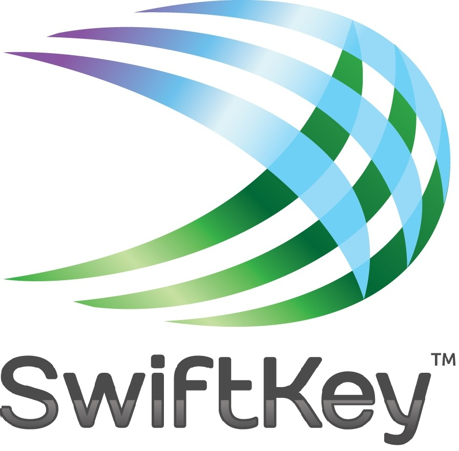

# Next Word Prediction using N-Grams with Interpolated Kneser Ney Smoothing
---

##  Data Science Capstone Project in partnership with SwiftKey
 

---

This application accepts a phrase and attempts to predict the most likely next words. This is done using *Language Modeling* which applies statistical information gained from an existent body (*corpus*) of text to determine the relative probabilities of various word sequences.

## Markov Assumption
The *Chain Rule of Probability* gives the probability of a sequence of words:

`P(a,b,c,d,e ...) = P(a) * P(b|a) * P(c|a,b) * P(d|a,b,c) * P(e|a,b,c,d)* ...`

*Markov assumption*: The probability of some future event (next word) depends mostly on a limited history of preceding events (previous words). So: 

`P(z|...v,w,x,y) ~ P(z|y)`  
or   
`P(z|...v,w,x,y) ~ P(f|x,y)` 
etc...

This means we can reason effectively with much smaller sequences, or N-grams, of words. We will occasionally miss out on some long distance depenedencies but in practice N-grams have proven to be very effective.

## N-Grams
An N-gram is a sequence of N words. For instance a bi-gram is a sequence of 2 words, a tri-gram 3 etc.

We can estimate probabilities using N-grams with a **Maximum Liklihood Estimate**. For instance MLE for "John likes chips" would be: 

`COUNT("John like chips")/COUNT("John likes")`

So if we gather N-gram statistics from a typical *corpus* we will be able to estimate probabilities thus.

## Unseen N-grams
What happens when we have an N-gram that is unseen in the dataset? Simple MLE leads to a probability of 0 in this case. In this situation we need to apply some sort of *smoothing*. This is essentially *borrowing* probability mass from the N-grams we've seen and giving it to the ones we haven't. For instance *Laplace* smoothing adds 1 to all counts and the MLEs are normalised accordingly. This a very crude tool and is not used very much in N-gram Language Models.

## Backoff and Interpolation
If we have a tri-gram that has not been seen, say "Jemima likes chips", but we have seen "likes chips" then it makes sense to "backoff" to the lower order N-gram model.

A more sophisticated approach is to user *Interpolation*. This uses a weighted sum of all levels of the N-gram hierarchy (eg quadgram, trigram, bigram) to give a combined probability. The weights used for this must be chosen carefully so that we get a true probability and the optimum level of prediction.

*Absolute Discounting* formalises the setting of these weights as a function of the discount applied and the relative success of higher order matching.

## Kneser-Ney smoothing

*Kneser-Ney smoothing* is a further refinement of *Absolute Discounting* but for the lower order estimates, rather than using the actual counts of N-grams, instead use is made of the *Continuation Counts*. For example at the Unigram level rather than use the number of times a word occurs use the number of different other words a word can follow. The popular example given is that of "Francisco". It is a popular word so has a relatively high actual count but it usually only follows "San". You don't want to give it too much weight at the lower order because it's popularity has already been catered for at the higher order.

*Interpolated Kneser-Ney smoothing* has proven to be one of the most effective forms of smoothing with N-grams.

## Data Preparation

The N-gram data for this application was prepared using the *tm* and *RWeka* packages in R. The HC corpus was read into a tm *VCorpus* and the data was cleaned by: -

* Removing non-English characters.
* Removing numbers.
* Removing most punctuation. Intra-word hyphens and apostrophes were retained.
* Conversion to lower case.
* Excessive white-space stripped.

Now for each level of N-gram a *Document Term Matrix* was created using the Weka Tokenizer set for the appropriate size of N-gram. This was then used to compute the counts for all the N-grams across the Corpus.

With such a relatively large Corpus it was necessary to devote a lot of computing resource to this processing. It was necessary to use a very large jvm for Weka to manage the higher order N-grams. The generation of all the N-gram data took several hours.

Once generated the complete N-gram data was multiple gigabytes in size so some compromise was required. Not only is there a limit to the size of the data one can upload to the Shiny Apps server there is a performance overhead to the application if these datasets are large. For this reason it was decided to keep only Unigrams occurring more than once and higher order N-grams occurring more than 10 times. This resulted in a complete set of N-gram data which compressed to about 8MB on disk and occupies about 100MB of memory.

## This Application

This application applies the principals of *Interpolated Kneser-Ney Smoothing* to derive a list of candidate words which can follow the supplied phrase. This list is returned in decreasing order of probability.

The supplied phrase is first processed using the same rules as for the Corpus.

The algorithm uses a recursive function which, for each level of the available N-gram hierarchy, the supplied phrase is used to filter the available N-grams and sorted by count (or *continuation count* for lower order). These lists of words are weighted and combined according to Kneser-Ney and a resulting list of words is returned. 

The code loads the N-gram frequencies as a list of arrays. Due to the recursive nature of the algorithm any number of levels of N-gram can be used. In this case I have opted to go up to *quadgrams*.

To deal with unseen words in the pre-processing a check is made to see if the word is in the vocabulary. If it is not then the word is converted to a wildcard. I'm not entirely certain this is strictly within the Kneser-Ney paradigm but it gives suggestions better than the default when the last word is unseen.

## Further work

* Incorporate users' input phrases into the Corpus to personalise suggestions. 
* Larger corpus.
* Higher order N-grams.
* Handle numbers.
* Handle beginings and ends of sentences.
* More formal treatment of unseen words.
* Remove offensive language.
* Recapitalise I, I've, I'll etc.

## Acknowledgments and References

[My Shiny App](https://jph65.shinyapps.io/Capstone_Predict/)

[HC Corpora](http://www.corpora.heliohost.org/)

[Stanford NLP Course](https://www.coursera.org/course/nlp)

[Chen-Goodman 1999](http://u.cs.biu.ac.il/~yogo/courses/mt2013/papers/chen-goodman-99.pdf)

[Kneser Ney Smoothing](http://www.foldl.me/2014/kneser-ney-smoothing/)
